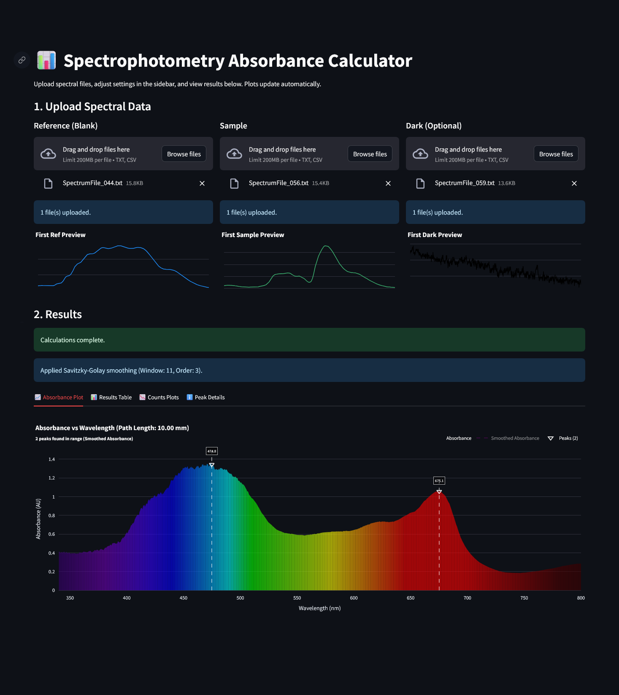
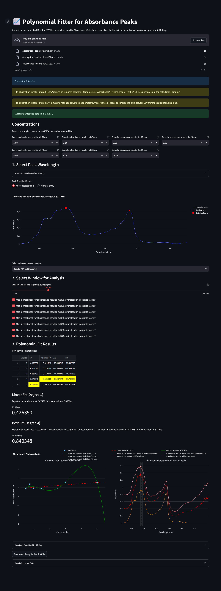
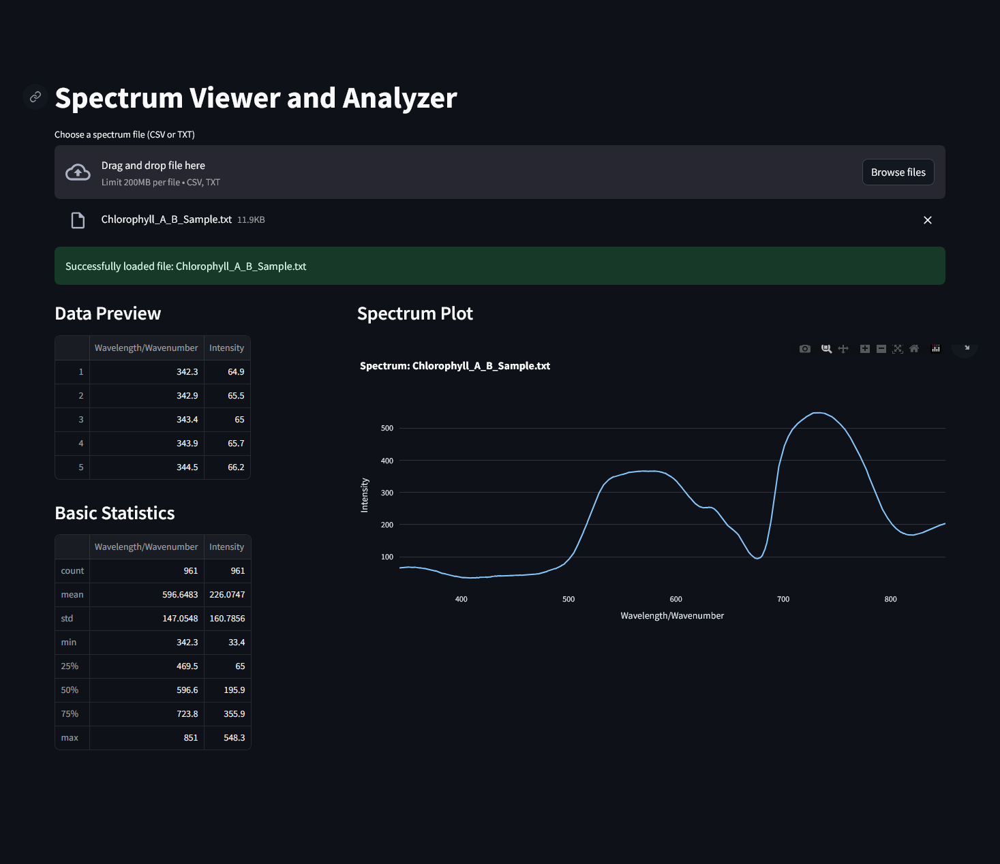

## Streamlit Link: [Spectrophotometry Absorbance Calculator](https://spectrophotometry-analysis.streamlit.app/)

# Spectrophotometry Analysis Suite

A collection of Streamlit tools designed for processing, analyzing, and visualizing spectrophotometry data.

## Features

This repository includes the following Streamlit applications:

* **Absorbance Calculator (`Absorbance_Calculator.py`)**:

    * Upload reference (blank), sample, and optional dark spectra files (`.txt`, `.csv`).
    * Calculate absorbance spectra.
    * Apply Savitzky-Golay smoothing to absorbance data.
    * Detect and visualize absorption peaks.
    * Plot raw counts, dark-corrected counts, and final absorbance.
    * Download calculated results.
* **Polynomial Fitter (`Polynomial_Fitter.py`)**:
  
    * Upload multiple absorbance spectra CSV files (e.g., from the Absorbance Calculator) and input corresponding concentrations.
    * Select a target peak wavelength (auto-detect or manual).
    * Perform polynomial fitting (degrees 1-5) on concentration vs. peak absorbance data.
    * Display fit statistics ($R^2$, Adjusted $R^2$, AIC, BIC) and fit equations.
    * Visualize the concentration curve and the original spectra with marked peaks.
    * Download analysis results.
* **Spectrum Viewer (`Preview_Spectra.py`)**:
  
    * Upload a single spectrum file (`.csv`, `.txt`).
    * View a data preview and basic statistics.
    * Display an interactive plot of the spectrum.

## Requirements

* Python 3.x
* Streamlit
* Pandas
* Numpy
* Plotly
* Scipy

You can install the required libraries using pip:
```bash
pip install streamlit pandas numpy plotly scipy
